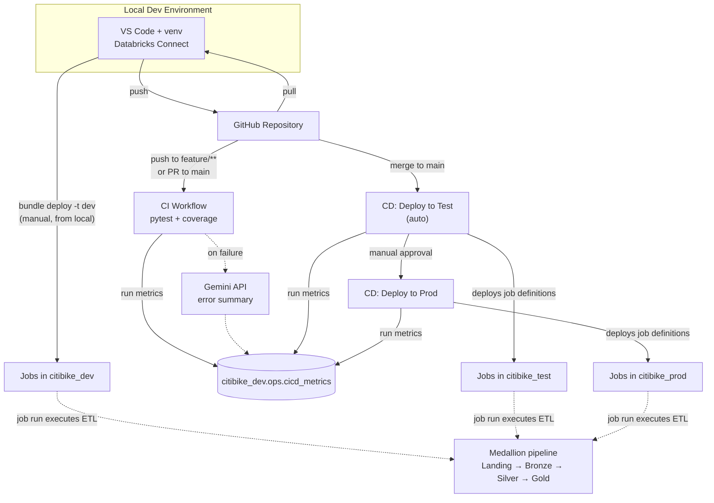

# Citi Bike CI/CD Data Pipeline (Databricks Asset Bundles)


## 📌 Project Overview

This project is a hands-on **CI/CD and data engineering** pipeline built around Citi Bike trip data. It combines the **Medallion Architecture** (Landing → Bronze → Silver → Gold) with a full **CI/CD workflow** based on Databricks Asset Bundles and GitHub Actions, covering three environments (dev / test / prod).

Beyond the core pipeline, the project adds three things that go past the standard tutorial scope:

- **Analytics layer** — the Gold tables feed a Power BI dashboard answering business questions about ride volume trends, station popularity and trip duration patterns.
- **Pipeline observability** — every CI/CD run writes its own metrics (duration, status, branch, environment) into a Databricks table, visualized in a second Power BI dashboard.
- **AI-assisted debugging** — when a CI run fails, the pytest output is summarized by the Gemini API and stored alongside the run metrics, so failures are readable at a glance.

The entire project runs on the free **Databricks Free Edition** (serverless-only, AWS), which required a number of deliberate adaptations from the standard enterprise setup — documented below.

---

## 🔄 Medallion Architecture

*(insert your Medallion diagram image here)*

Data flows through four layers, replicated across three catalogs (`citibike_dev`, `citibike_test`, `citibike_prod`):

| Layer | Schema | Content |
|---|---|---|
| **Landing** | `00_landing` | Raw CSV files in a Databricks Volume, all columns as string |
| **Bronze** | `01_bronze` | Explicit schema (StructType), type conversion (timestamp, decimal), metadata column for lineage |
| **Silver** | `02_silver` | Derived columns: `trip_duration_mins`, `trip_start_date` |
| **Gold** | `03_gold` | Two aggregates: `daily_ride_summary` (citywide daily stats) and `daily_station_performance` (per-station daily stats) |

---

## 🔧 CI/CD Workflow



The `dev` target is deployed manually from the local machine (`bundle deploy -t dev`) and is not part of the automated CI/CD flow — it exists for iterating on the pipeline before pushing anything. Because `dev` uses `mode: development`, its jobs are automatically prefixed with the developer's name, which is what keeps them separate from the `test` and `prod` jobs in the same shared workspace.

**CI Workflow** (`.github/workflows/ci-workflow.yml`) — triggered on push to `feature/**` or PR to `main`. Runs on Ubuntu: installs dependencies, executes pytest with a coverage report (uploaded as an artifact).

**CD Workflow** (`.github/workflows/cd-workflow.yml`) — triggered on push to `main`. Two sequential jobs: automatic deploy to **test**, then deploy to **prod** gated behind a manual approval (GitHub Environments with required reviewers).

Note that CD deploys *job definitions* — the tables are populated when a job actually runs, not by the deployment itself.

---

## ⚙️ Engineering Highlights

**Three parallel implementations of the same pipeline** — the same Bronze→Silver→Gold logic is implemented three ways, each deployed as a separate Databricks job, to compare the approaches:

1. **Notebook jobs** (`notebook_task`) — parameters via `dbutils.widgets.get()`
2. **Python script jobs** (`spark_python_task`) — parameters via `sys.argv` positional arguments
3. **Delta Live Tables** (`@dlt.table`) — declarative; dependencies resolved automatically via `dlt.read()`, no manual `depends_on`

**Environment parameterization** — a single `catalog` variable declared in `databricks.yml` with per-target values means the exact same notebook and script code runs unchanged across dev/test/prod; table names are built with f-strings rather than hardcoded.

**Reusable code as a wheel package** — shared helpers (`citibike_utils`, `datetime_utils`) are packaged via `setup.py` into an installable `.whl`, eliminating `sys.path.append()` hacks in the pipeline code. On serverless, the wheel is attached through a job-level `environments` block with `spec.dependencies`, since the classic `libraries:` syntax is not supported.

**Unit tests** — pytest tests for the transformation helpers, running in CI on Ubuntu with a coverage report.

**Pipeline observability** — each CI/CD job writes a row into `citibike_dev.ops.cicd_metrics` via the Databricks SQL Statement Execution API (`if: always()`, so failed runs are captured too — those are the interesting ones).

---

## 🤖 AI-Assisted Debugging & Security Architecture

When a CI run fails, the last 80 lines of pytest output are sent to the Gemini API, and the returned summary is written into the `ai_summary` column of `cicd_metrics`. On successful runs the column stays `NULL`.

**Security note:** only technical error messages and system logs are ever sent to the LLM — no production, business, or personal data leaves the environment. Unit tests operate exclusively on hardcoded test values, so even assertion tracebacks contain no real data. Should tests ever run against production data, this step would need to be reconsidered (e.g. filtering the log before sending).

---

## 💻 Local Development & Testing

Development happens locally in VS Code against remote serverless compute via **Databricks Connect**, using a fallback pattern so the same code works both locally and on Databricks:

```python
try:
    from databricks.connect import DatabricksSession
    spark = DatabricksSession.builder.getOrCreate()
except ImportError:
    from pyspark.sql import SparkSession
    spark = SparkSession.builder.master("local[*]").getOrCreate()
```

**A note on local testing:** running pytest against a pure local PySpark installation on Windows consistently crashed (`Python worker exited unexpectedly`). After systematically ruling out Java versions, firewall/antivirus, encoding, and dependency versions, the cause was narrowed down to a known fragility of PySpark's local Python worker processes on Windows (no `fork()` — each task spawns a new `python.exe`).

This diagnosis was **confirmed empirically by CI**: the exact same tests pass on `ubuntu-latest` in GitHub Actions. Locally, tests run through Databricks Connect instead, which sidesteps the issue entirely by not running Spark on the local machine. The test code and `requirements_pyspark.txt` remain in the repo; a WSL2 or devcontainer setup would be the standard fix.

---

## 📊 Power BI Dashboards

*(insert your dashboard screenshots here)*

**Dashboard 1 — CI/CD Metrics:** Deployment frequency, success rate, average duration and failure count, broken down by job and environment, with a table of recent failures including the AI-generated error summaries.

**Dashboard 2 — Citi Bike Analytics:** Ride volume trends over time, top stations by trip count and average duration, and a scatter plot for spotting station-level outliers.

**A note on data sources:** Dashboard 2 connects to the Gold tables in `citibike_prod`. Dashboard 1 reads from `citibike_dev.ops.cicd_metrics` — a single shared table across all environments, by design: pipeline run metrics are operational telemetry about the deployment process itself, not environment-specific business data, and keeping them in one place avoids unioning three sources in Power BI.

**A note on the data model:** the two Gold tables are joined only on `trip_start_date`. Since the summary table operates at citywide grain with no station dimension, selecting a station in the slicer filters the station-level charts while the top KPIs and trend line intentionally reflect citywide totals. This is an expected consequence of the differing grain of the two tables, not a limitation — and it's annotated directly on the dashboard.

**Known data quirk:** a handful of stations show inflated average trip duration (up to ~53 min against an overall average of ~8.6 min). These are low-trip-count stations where a few outlier rides — most likely improperly docked bikes — skew the average. Left in the data deliberately and visible in the outlier scatter plot.

---

## 🛠️ Technology Stack

- **Platform:** Databricks Free Edition (serverless, AWS)
- **Deployment:** Databricks Asset Bundles, Databricks CLI
- **CI/CD:** GitHub Actions, GitHub Environments
- **Processing:** Apache Spark (PySpark), Delta Live Tables
- **Storage:** Delta Lake, Unity Catalog
- **Testing:** pytest, pytest-cov, Databricks Connect
- **BI:** Power BI (Databricks SQL Warehouse connector)
- **AI:** Google Gemini API
- **Tools:** VS Code, Git & GitHub, Python 3.12

---

## 📂 Repository Structure

```
├── databricks.yml              # Bundle definition, targets, variables
├── setup.py                    # Wheel packaging for shared modules
├── pyproject.toml              # Build config (used by pip in CI)
├── requirements_pyspark.txt    # Pure PySpark deps for CI test runs
│
├── src/                        # Shared code, packaged into a .whl
│   ├── citibike/               # get_trip_duration_mins()
│   └── utils/                  # timestamp_to_date_col()
│
├── citibike_etl/               # Three implementations of the same pipeline
│   ├── notebooks/              # Notebook tasks
│   ├── scripts/                # Python script tasks
│   └── dlt/                    # Delta Live Tables
│
├── resources/                  # Asset Bundle job & pipeline definitions
│   ├── citibike_etl_pipeline_nb.job.yml
│   ├── citibike_etl_pipeline_py.job.yml
│   └── citibike_etl_pipeline.dlt.yml
│
├── tests/                      # pytest unit tests + conftest.py
├── powerbi/                    # Power BI dashboard files (.pbix)
├── docs/                       # Architecture diagrams
│
└── .github/workflows/
    ├── ci-workflow.yml         # pytest + coverage
    └── cd-workflow.yml         # deploy to test → approval → prod
```

---

## 🧩 Deviations from a Standard Enterprise Setup

The course this project is based on assumes a paid Azure Databricks environment. Running it on Databricks Free Edition required working around several constraints — each of these was a problem to diagnose and solve rather than a step to follow:

| Standard enterprise setup | This project | Why |
|---|---|---|
| 3 separate Azure workspaces (dev/test/prod) | 1 workspace + 3 catalogs (`citibike_dev/_test/_prod`) + 3 CLI profiles | Free Edition provides a single workspace |
| Microsoft Entra ID authentication | Personal Access Token (PAT) | Entra ID is Azure-specific, unavailable on Free Edition (AWS) |
| Azure Service Principal for CI/CD (3 secrets) | PAT stored in GitHub Environments (2 secrets) | Service principals unavailable on Free Edition |
| Classic clusters with explicit cluster config | Serverless compute, `serverless_compute_id = auto` | Free Edition is serverless-only |
| `libraries: - whl:` per task | `environment_key` + job-level `environments` block | Classic-cluster syntax rejected on serverless |
| Unique job names per workspace | `${bundle.target}` suffix in job names | Test and prod share one workspace, so identical job names overwrote each other |

The last row is a good example: because `test` and `prod` both use `mode: production` (no automatic `[dev user]` prefix) and deploy to the same `/Workspace/Shared/` path, they silently overwrote each other. Adding `${bundle.target}` to the job name produced three cleanly separated jobs — a collision that simply cannot occur in the multi-workspace setup the course assumes.

---

## 🤝 Course Inspiration & Credit

*(add your course link here)*

This project follows the structure of a Udemy course on CI/CD with Databricks Asset Bundles. The core CI/CD concepts and Medallion structure come from the course; the following were developed independently:

- **Platform adaptation:** the entire Free Edition setup (serverless, PAT auth, single-workspace/multi-catalog design) — see the deviations table above.
- **Pipeline observability:** the `cicd_metrics` table, writing run metrics from GitHub Actions via the SQL Statement Execution API, and the CI/CD Power BI dashboard.
- **AI-assisted debugging:** the Gemini API integration for summarizing CI failures.
- **Analytics layer:** the second Power BI dashboard over the Gold tables.
- **Troubleshooting:** the local testing investigation (Windows worker crashes), the wheel packaging issues, and the serverless environment configuration were all diagnosed independently, as the course setup does not encounter them.
